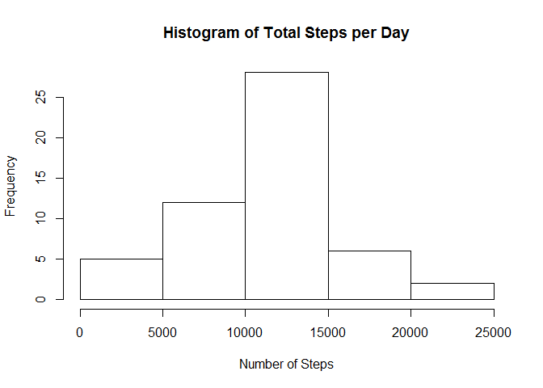
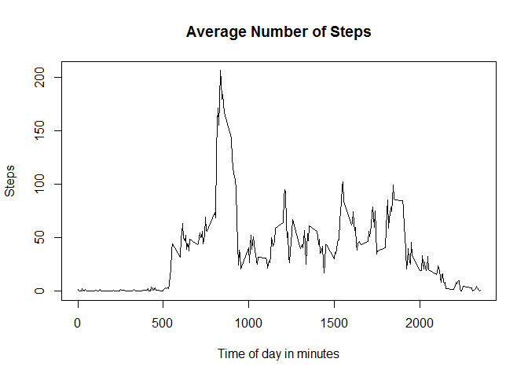
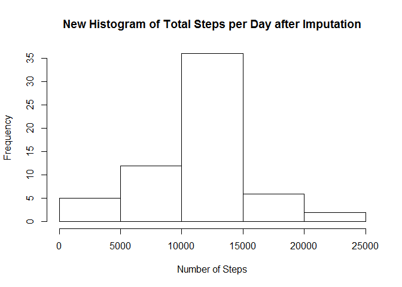
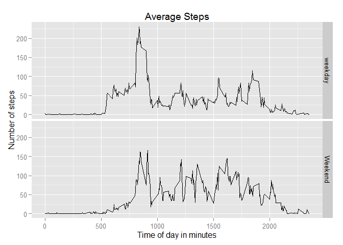

# Reproducible Research: Peer Assessment 1


## Loading and preprocessing the data

1. **Load the data from CSV file** 

**Assumption**: csv file was downloaded and extracted in working directory
  

```r
#read csv file from working directory
filedata<-read.csv('activity.csv', header=TRUE)
#review number of observations and variables
dim(filedata)
```

```
## [1] 17568     3
```

```r
#review sample of data
head(filedata)
```

```
##   steps       date interval
## 1    NA 2012-10-01        0
## 2    NA 2012-10-01        5
## 3    NA 2012-10-01       10
## 4    NA 2012-10-01       15
## 5    NA 2012-10-01       20
## 6    NA 2012-10-01       25
```

The variables included in this dataset are:

* **steps**: Number of steps taking in a 5-minute interval (missing values are coded as NA)
* **date**: The date on which the measurement was taken in YYYY-MM-DD format
* **interval**: Identifier for the 5-minute interval in which measurement was taken
  
  
2. **Use only complete cases**

```r
#filters complete cases only
fd_complete<-filedata[complete.cases(filedata),]
#review number of observations and variables
dim(fd_complete)
```

```
## [1] 15264     3
```

```r
#review sample of data
head(fd_complete)
```

```
##     steps       date interval
## 289     0 2012-10-02        0
## 290     0 2012-10-02        5
## 291     0 2012-10-02       10
## 292     0 2012-10-02       15
## 293     0 2012-10-02       20
## 294     0 2012-10-02       25
```


## What is mean total number of steps taken per day?

1. **Make a histogram of the total number of steps taken each day**

```r
#sum total steps by date on complete cases
fd_dailysum <- aggregate(fd_complete$steps, by = list(fd_complete$date), FUN = sum)
#rename columns
colnames(fd_dailysum)[1:2] <- c("date", "steps")
#draw histogram
hist(fd_dailysum$steps, main="Histogram of Total Steps per Day", xlab="Number of Steps")
```

 

2. **Calculate and report the mean and median total number of steps taken per day**

```r
mean(fd_dailysum$steps)
```

```
## [1] 10766.19
```

```r
median(fd_dailysum$steps)
```

```
## [1] 10765
```
The mean is 1.0766189\times 10^{4} while the median is 10765

## What is the average daily activity pattern?
1. **Make a time series plot (i.e. type = "l") of the 5-minute interval (x-axis) and the average number of steps taken, averaged across all days (y-axis)**

```r
#sum total steps by date on complete cases
fd_mean_int <- aggregate(fd_complete$steps, by = list(fd_complete$interval), FUN = mean)
#rename columns
colnames(fd_mean_int)[1:2] <- c("interval", "steps")
## plot data
plot(fd_mean_int$interval,fd_mean_int$steps,type ="l",
     main="Average Number of Steps", 
     ylab="Steps",
     xlab="Time of day in minutes")
```

 
  
  
2. **Which 5-minute interval, on average across all the days in the dataset, contains the maximum number of steps?**  

```r
fd_mean_int[which.max(fd_mean_int$steps),]
```

```
##     interval    steps
## 104      835 206.1698
```
The 5-mintue interval of 835 contains the maximum number of steps = 206.1698113 


## Imputing missing values

1. **Calculate and report the total number of missing values in the dataset (i.e. the total number of rows with NAs)**

```r
#calculate total number of missing values
sum(is.na(filedata$steps))
```

```
## [1] 2304
```
The total number of missing data is 2304  
  
  
2. **Devise a strategy for filling in all of the missing values in the dataset.**   
The strategy for missing input will be the mean for that 5-minute interval. I'll use the sames values from the data frame **fd_mean_int** that was calculated ealier   

3. **Create a new dataset that is equal to the original dataset but with the missing data filled in.**

```r
    #  make a copy of original data set
    fd_imputation <- filedata

    # imputation of mean for the missing 5 minute interval
    for (i in 1:nrow(fd_imputation)){
            if (is.na(fd_imputation$steps[i])){
                  # get the interval
                  orig_int <- fd_imputation$interval[i]
                  # retrive the mean steps for the selected interval
                  mean_steps <- fd_mean_int$steps[which(fd_mean_int$interval == orig_int)]
                  # update with calculated mean
                  fd_imputation$steps[i] <- mean_steps
            }
    }
```

4. **Make a histogram of the total number of steps taken each day. Calculate and report the mean and median total number of steps taken per day. Do these values differ from the estimates from the first part of the assignment? What is the impact of imputing missing data on the estimates of the total daily number of steps?**

The new histogram after imputation is shown below

```r
#sum total steps by date on the imputation data set
fd_dailysum_new <- aggregate(fd_imputation$steps, by = list(fd_imputation$date), FUN = sum)
#rename columns
colnames(fd_dailysum_new)[1:2] <- c("date", "steps")
#draw histogram
hist(fd_dailysum_new$steps, main="New Histogram of Total Steps per Day after Imputation", xlab="Number of Steps")
```

 

Mean and Median after imputation is shown below

```r
mean(fd_dailysum_new$steps)
```

```
## [1] 10766.19
```

```r
median(fd_dailysum_new$steps)
```

```
## [1] 10766.19
```
The Mean and Median values are different from the first part of the assigment. The Mean is the same however the Median is a little higher. Mean and Median are the same after Imputation. The strategy I adopted for Imputation made the data evenly sampled.

## Are there differences in activity patterns between weekdays and weekends?
1. **Create a new factor variable in the dataset with two levels - "weekday" and "weekend" indicating whether a given date is a weekday or weekend day.**

```r
#using imputation data set convert variable from string to date
fd_imputation$date <- as.Date(fd_imputation$date, "%Y-%m-%d")
#add new variable and set default value to weekday
fd_imputation$Weekday_type<-"weekday"
#update weekday_type for weekends
for (i in 1:nrow(fd_imputation)){
    if (weekdays(fd_imputation$date[i])=="Sunday" || weekdays(fd_imputation$date[i])=="Saturday"){
        fd_imputation$Weekday_type[i]<-"Weekend"
    }
}
```

2. **Make a panel plot containing a time series plot (i.e. type = "l") of the 5-minute interval (x-axis) and the average number of steps taken, averaged across all weekday days or weekend days (y-axis).**

```r
#average total steps by weekday type and interval on the new data set
fd_weekday_mean <- aggregate(fd_imputation$steps, 
                            by = list(fd_imputation$Weekday_type,fd_imputation$interval),
                            FUN = mean)
#rename columns
colnames(fd_weekday_mean)[1:3] <- c("weekday_type", "interval", "steps")
#load ggplot library
library(ggplot2)
# plot data with facets
ggplot(fd_weekday_mean, aes(interval, steps)) + geom_line() + facet_grid(weekday_type ~ .) + 
    xlab("Time of day in minutes") + ylab("Number of steps") + ggtitle("Average Steps")
```

 
